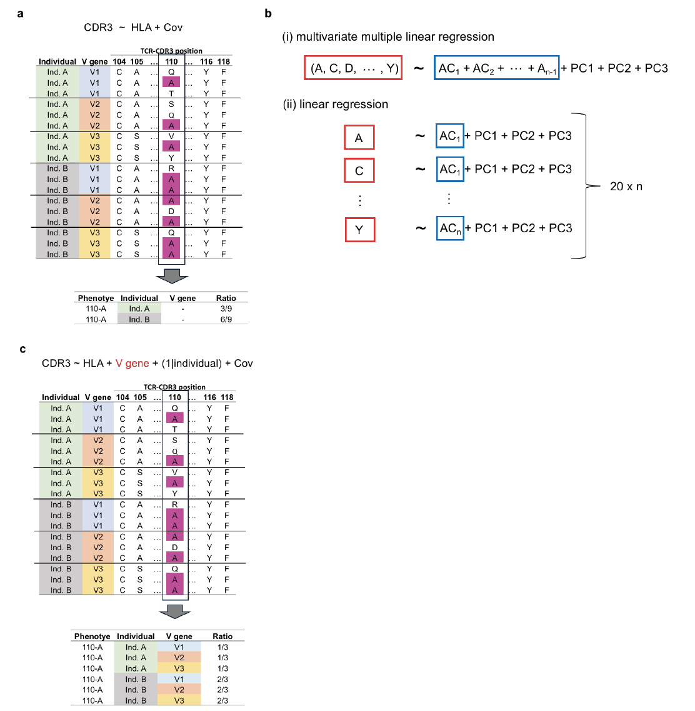

# Overview
We tested associations between HLA genotypes and TCR-CDR3 amino acid compositions. We treated the amino acid composition of CDR3 as a quantitative trait, and tested its association with HLA genotype; we call this CDR3 quantitative trait loci analysis (cdr3-QTL). This webpage contains the codes and the summary statistics from cdr3-QTL analysis. 
Reference: the manuscript is in submission (doi: in progress).

# Main dataset
We utilized publicly available TCR dataset. All raw TCR sequence data and genotype data of the discovery dataset and the replication dataset are available at Adaptive Biotechnologies immuneACCESS site: https://clients.adaptivebiotech.com/pub/emerson-2017-natgen
- Reference: Emerson, R. O. et al. Immunosequencing identifies signatures of cytomegalovirus exposure history and HLA-mediated effects on the T cell repertoire. Nat. Genet. 1–10 (2017). doi:10.1038/ng.3822

## Results 1: the main results from cdr3-QTL analysis
We utilized three different linear models as explained in this figure.

## Results 2: CDR3 risk score
We developed a scoring system that quantifies the enrichment of these patterns in a given CDR3 sequence (we refer to this as the CDR3 risk score).

