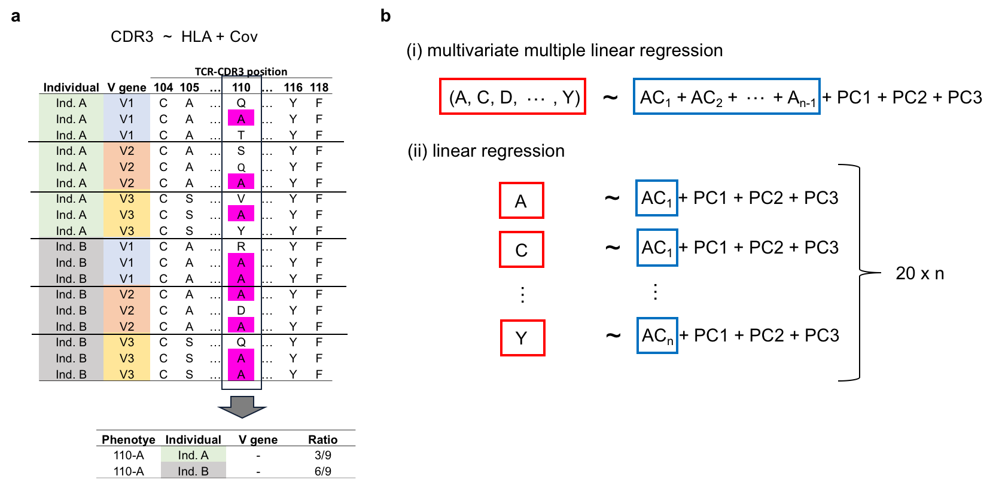
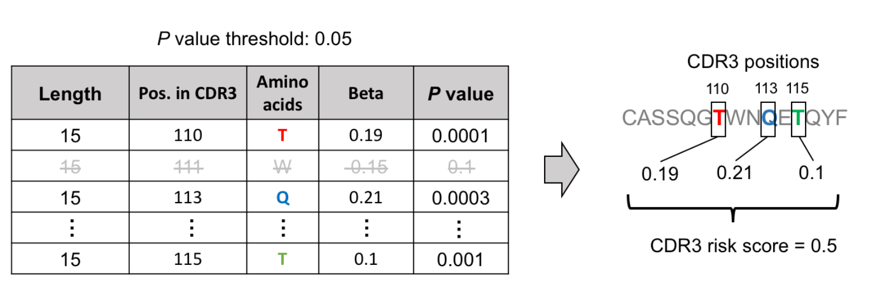
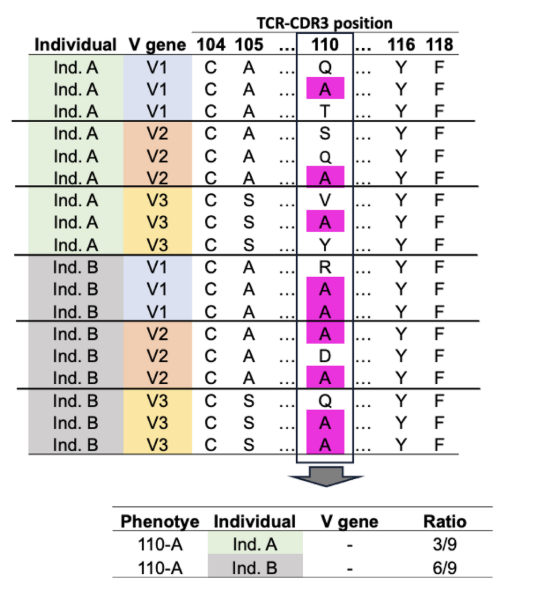

# Overview
We tested for associations between HLA genotypes and TCR-CDR3 amino acid composition. We treated the amino acid composition of CDR3 as a quantitative trait, and tested its association with HLA genotypes; we call this CDR3 quantitative trait loci analysis (cdr3-QTL). This webpage contains the code and summary statistics from our cdr3-QTL analysis. 
- Reference: Ishigaki K et al. HLA autoimmune risk alleles restrict the hypervariable region of T cell receptors. MedRxiv 2020
(https://www.medrxiv.org/content/10.1101/2020.11.08.20227983v1

## Main dataset
We analyzed a publicly available TCR dataset. All raw TCR sequence data and genotype data of the main dataset are available at Adaptive Biotechnologies immuneACCESS site: https://clients.adaptivebiotech.com/pub/emerson-2017-natgen
- Reference: Emerson, R. O. et al. Immunosequencing identifies signatures of cytomegalovirus exposure history and HLA-mediated effects on the T cell repertoire. Nat. Genet. 1–10 (2017). doi:10.1038/ng.3822

## Why did we conduct this study?
- Polymorphisms in the human leukocyte antigen (HLA) genes within the major histocompatibility complex (MHC) locus strongly influence autoimmune disease risk.
- Two non-exclusive hypotheses exist about the pathogenic role of HLA alleles:
- i) the central hypothesis, in which HLA risk alleles influence thymic selection to increase the frequency of T cell receptors (TCRs) reactive to autoantigens
- ii) the peripheral hypothesis, in which HLA risk alleles increase the presentation of autoantigens to the immune system
- Research in human autoimmunity has focused on the peripheral hypothesis, with little evidence to date for the central hypothesis.
- Therefore, to explore genetic evidence supporting the central hypothesis, we investigated the influence of HLA alleles on TCR composition at the highly diverse complementarity determining region 3 (CDR3), where the TCR recognizes antigens.

## How did we generate quantitative phenotypes from TCR sequence data?
- Our strategy to generate quantitative CDR3 phenotypes. We utilized amino acid frequencies (panel a). In this example, alanine (A) usage ratio at CDR3 position 110 is calculated for each individual.

## Main models in our analysis (panel b)
- **We prepared a vignette and example input datasets to explain our models (./vignettes/example_cdr3QTL_v2.ipynb and ./vignettes/DRB1_site13_L13CDR3_p109.RData)**
- (i) multivariate multiple linear regression: a vector of frequency of 20 amino acids at a given position of CDR3 is the response variable; all amino acid alleles except one at a site of HLA are the explanatory variables.
- (ii) linear regression model: the frequency of a single amino acid at a position of CDR3 is the response variable; a single amino acid allele at a site of HLA is the explanatory variable.

## Results from our cdr3-QTL analysis

### Results 1: the main results from cdr3-QTL analysis (./summary_stats/). 
- When a file name includes "rm_gl", it indicates that the results were based on CDR3 phenotypes excluding germline-encoded sequences.

### Results 2: CDR3 risk score
- **We provide an example script to calculate CDR3 risk scores (../cdr3-risk-score/cdr3_risk_score_demo.R).**
- From results 1, we found many CDR3 amino acid patterns associated with the HLA risk of autoimmune diseases. We developed a scoring system that quantifies the enrichment of these patterns in a given CDR3 sequence (we refer to this as the CDR3 risk score). 
- This is a schematic explanation of our strategy to calculate CDR3 risk score. The table shows the effect size estimate of cdr3-QTL analysis based on HLA risk scores (explained in our manuscript). Effect sizes for corresponding amino acids are summed when such amino acids exist in a target CDR3 sequence. This sum is defined as the CDR3 risk score. Only effect sizes that pass a P value threshold are utilized. Although the threshold of P < 0.05 is used in this example figure, we used the Bonferroni-corrected P < 0.05 in our final analysis.

## How the CDR3 amino acid phenotypes were calculated?
- **We prepared a vignette explaining how we created CDR3 amino acid (AA) phenotypes in our manuscript (./vignettes/cdr3_phenotype_demo_v1.ipynb)**.
- Essentially, we simply used AA usage frequencies as illustrated below. 

